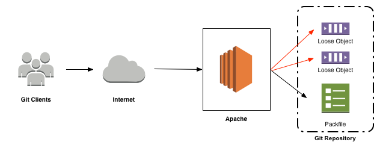
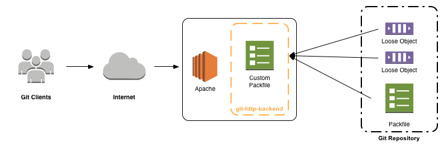
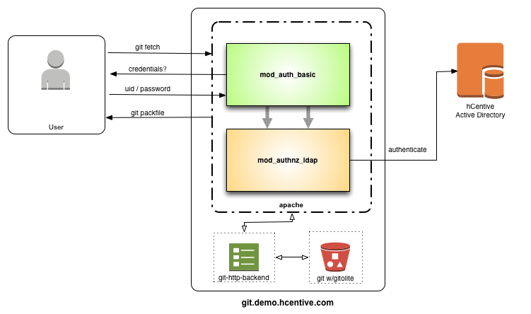

Setting up Git over HTTP with Active Directory authentication
=============================================================
This document describes how to setup a git server over http, using [git-http-backend](http://git-scm.com/docs/git-http-backend), with Active Directory for authentication.

## Why HTTP?

`http` is one of the [three protocols supported by git](http://git-scm.com/book/ch4-1.html). The other two are `git` and `ssh`.

Serving a repository over `git` is not an option for hCentive because of the lack of authentication in the protocol.

`ssh` requires managing key pairs for authentication for every user in the organization. That works well in a small organization. But when the number of employees increases, it becomes difficult to manage keys with new employees joining and some old ones leaving.

Until version 1.6.6, `ssh` was the preferred protocol because with `http` the server was completely passive. That means if a client requested one object in a packfile of thousands, the server was unable to server that request. As a result, the client was forced to request the entire packfile.
The other two protocols, `git` and `ssh` would use `git-upload-pack` to build a custom packfile with just the objects needed by the client.



`git-http-backend` was released with version 1.6.6. It is a CGI program that works with `git-upload-pack` and `git-fetch-pack` to fetch and push objects, making git over `http` as efficient (if not more) than `git` and `ssh` protocols.



## Active Directory Authentication
To setup authentication and authorization with Apache, a combination of authentication type, authentication provider and authorization provider are required.

To authenticate against an Active Directory database, the following modules should be installed and setup
* Authentication type - `mod_auth_basic`
* Authentication provider - `mod_authnz_ldap`
* Authorization - `mod_authnz_ldap`

Authentication works like this -
* User runs a `git fetch` or a `git update` command
```
MacBookPro:~satyendra$ git clone https://git.demo.hcentive.com/sharedservices
```
* `mod_auth_basic` prompts for credentials
* User enters their Active Directory credentials
* `mod_auth_basic` passes the credentials to `mod_authnz_ldap` authentication provider which is setup to authenticate against hCentive's Active Directory server
* if authentication passes, apache hands of the git command to `git-http-backend` to process
* `git-http-backend` creates a _packfile_, with the requested objects, that is streamed back to the user



`NOTE:` Although `mod_authnz_ldap` is used for authorization, it's only requirement is that the user is an authenticated active directory user. Repository authorization is delegated to [gitolite](https://hcentive.jira.com/wiki/display/TECHOPS/Git+access+control+with+Gitolite).

## Installation
Git server is installed on a EC2 instance with an EBS volume attached to it for repositories.
### Prerequisites
* git 1.6.6 or above
* Apache 2.x
* EBS volume to store repositories

## Setup
### Git installation
Install Git on Ubuntu
```
$ sudo apt-get update
$ sudo apt-get install git
```

Create a user `git` with disabled password and login shell. This user will manage [gitolite configuration](gitolite_setup.md).
```
$ sudo adduser --system --group --shell /bin/bash --disabled-password git
```

### Create EBS volume
Create an EBS volume for git repositories and attach it to the instance.
```
$ instance_id=$(curl http://169.254.169.254/latest/meta-data/instance-id)
$ volume_id=$(aws ec2 create-volume --size 100 --region us-east-1 | jq '.VolumeId' | sed -e 's/^"//' -e 's/"$//')
$ device=/dev/xvdf
$ aws ec2 attach-volume --volume-id $volume_id --instance-id $instance_id --device $device
```

Format the volume.
```
$ sudo mkfs -t ext4 /dev/xvdf
$ sudo mkdir /git
$ sudo mount /dev/xvdf /git
```
Add the following entry in /etc/fstab to mount this volume on system restarts
```
/dev/xvdf       /git   ext4    defaults        0       2
```

Create a repositories folder.
```
$ sudo su - git
$ ln -s /git/repositories repositories
```

### Apache setup
The following modules should be enabled to server Git over apache -
* mod_alias
* mod_env
* mod_ssl
* mod_cgi
* mod_auth_basic
* mod_authnz_ldap

#### URL translation
Apache builds URL path by concatenating _PATH_INFO_ with `GIT_PROJECT_ROOT`. _PATH_INFO_ is set automatically by apache using the value of the `ServerName` variable. `GIT_PROJECT_ROOT` is set to the repositories folder `/home/git/repositories`.
```
ServerName git.demo.hcentive.com
SetEnv GIT_PROJECT_ROOT /home/git/repositories
SetEnv GIT_HTTP_EXPORT_ALL
ScriptAlias / /usr/lib/git-core/git-http-backend/
```

So, a repository path for `https://git.demo.hcentive.com/sharedservices` with translate to `/home/git/repositories/sharedservices.git`

#### git options
Setup options for git CGI utilities

```
<Directory "/usr/lib/git-core">
  Options +ExecCGI -Indexes
  Allow From All
</Directory>
```

Setup active directory authentication by setting `AuthType` to _Basic_. This will prompt users to enter their username and password.
Authentication provider is set to `ldap`. `mod_auth_basic` will delegate authentication to the configured LDAP (active directory) provider. `AuthzLDAPAuthoritative` is set to _off_ because authorization is handled by gitolite.

`AuthLDAPURL`, `AuthLDAPBindDN` and `AuthLDAPBindPassword` set up connectivity to hCentive's active directory server.

`Require` directive is set to _valid-user_. This allows access only if LDAP authentication is successful.

```
<Location "/">
    AuthType Basic
    AuthBasicProvider ldap
    AuthzLDAPAuthoritative off
    AuthName "Git Server"
    AuthLDAPURL "ldap://10.10.0.111:389/DC=hcentive,DC=com?sAMAccountName?sub?(objectClass=user)" NONE
    AuthLDAPBindDN "admin@hcentive.com"
    AuthLDAPBindPassword password
    Require valid-user
</Location>
```

After Apache is setup to authenticate against Active Directory. The next step is to configure authorization to git repositories. This is described in the [gitolite configuration documentaion](https://hcentive.jira.com/wiki/display/TECHOPS/Git+access+control+with+Gitolite).

References
----------
* [Git smart HTTP transport](http://git-scm.com/blog/2010/03/04/smart-http.html)
* [git-http-backend manpage](http://git-scm.com/docs/git-http-backend)
* [Apache mod_authnz_ldap](http://httpd.apache.org/docs/2.2/mod/mod_authnz_ldap.html)
