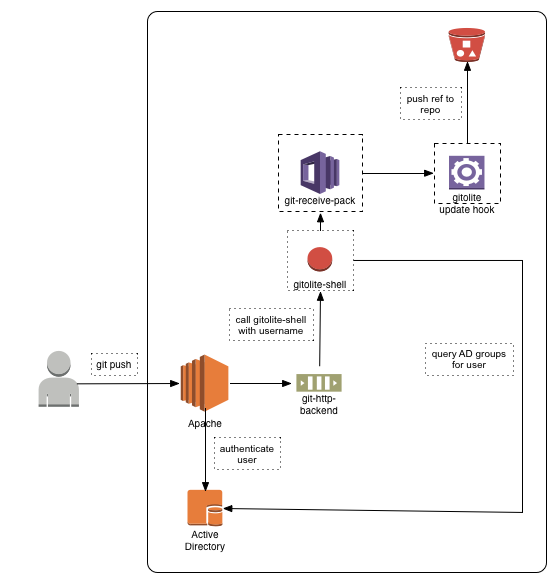

Git access control with Gitolite
================================

[Gitolite](https://github.com/sitaramc/gitolite) is an access control layer for a git server. It provides fine-grained authorization to git repositories. It does not provide authentication. Authentication for [hCentive's git server](https://git.demo.hcentive.com) is provided via Active Directory as described in the [git setup document](git_setup.md).

How it works
------------
To check access, gitolite installs an extra layer between `apache` and `git-receive-pack`/`git-upload-pack`. It installs its own [git hooks](http://git-scm.com/book/en/Customizing-Git-Git-Hooks) in every repository to check branches being pushed. Access is allowed or aborted based on the result of authorization checks.


To describe this better, let's take the use case of a user pushing code to a repo -



* user runs the `git push` command on their workstation
```
MacBookPro:~satyendra$ git push
```
* apache prompts the user for their credentials
* `mod_authz_ldap` validates the credentials against hCentive's active directory
* after authentication succeeds, apache calls the `gitolite-shell` with the username as an argument.
* `gitolite-shell` calls the [ldap_group_query.sh](ldap_group_query.sh) script to lookup active directory groups for the user.
* gitolite is configured to allow access to repositories to project specific groups. For example, the `shared_services` repo is only accessible to users that are assigned the _SHARED_SERVICES-INT_ group in active directory.
* if the user's group matches the one set for the repo in gitolite configuration, the git command is executed. Otherwise, the command is aborted and an error returned to the user.

`NOTE:` there may be other git hooks setup for specific repositories. These hooks are executed after authorization is successful.

Installation
------------
Gitolite (and git) are installed on an [EC2 instance](https://git.demo.hcentive.com) with a 100GB EBS volume attached to it for repositories. The EBS volume is mounted on `/git`. Git setup is described in the [git setup document](git_setup.md).

####Install gitolite

Get the software from Gitolite's git repo and install it. It is installed in the `git` user's home.
```
$ sudo su - git
$ git clone git://github.com/sitaramc/gitolite
$ mkdir $HOME/bin
$ gitolite/install -ln #defaults to $HOME/bin
```
####Upload administrator's public key

Copy the gitolite administrator's SSH public key.
```
MacBookPro:~satyendra$ scp ~/.ssh/id_rsa.pub ubuntu@git-server:/tmp/gitolite_admin.pub
```
If the key used to launch the git EC2 instance is the administrator's key, the public key is already present in `/home/ubuntu/.ssh/authorized_keys`. You can copy that key to `/tmp/gitolite_admin.pub` instead.

####Setup gitolite

Setup gitolite with the administrator's public key.
```
$ export PATH="$PATH:$HOME/bin"
$ gitolite setup -pk /tmp/gitolite_admin.pub
```
This will create two git repositories in the `repositories` directory - `gitolite-admin.git` and `testing.git`. It will also import `gitolite_admin.pub` to `~/.ssh/authorized_keys`.

#### Update Apache configuration

Apache should be configured to hand off git commands to `gitolite-shell`. As the gitolite-shell is owned by the git user, we create a wrapper script for it that is run as the git user by `suexec`.

Install `suexec` if not already installed -
```
$ sudo apt-get install apache2-suexec apache2-suexec-custom
```

Create the [wrapper script](gitolite-suexec-wrapper.sh) for `gitolite-shell` and copy it to `/var/www/bin` folder. Add the following contents to the script -
```
#!/bin/bash
#
# Suexec wrapper for gitolite-shell
#
export GIT_PROJECT_ROOT="/git/repositories"
export GITOLITE_HTTP_HOME="/home/git"
exec ${GITOLITE_HTTP_HOME}/gitolite/src/gitolite-shell
```
Add the following lines to the apache configuration -
```
SuexecUserGroup git git
ScriptAlias / /var/www/bin/gitolite-suexec-wrapper.sh/
```

Gitolite administration
-----------------------
Gitolite administration is done through the `gitolite-admin` repo created by the [gitolite install command](http://gitolite.com/gitolite/install.html#the-actual-install).

Clone the `gitolite-admin` repo.
```
MacBookPro:~satyendra$ git clone https://git.demo.hcentive.com/gitolite-admin
```
Enter your active directory username and password when prompted.

The `conf/gitolite.conf` file specifies detailed access control for repos. The file looks like this -
```
@gitolite-admins = satyendra

repo gitolite-admin
    RW+     =    @gitolite-admins

repo testing
    RW+     =    @gitusers

```
Fine-grained control to repositories can be setup by following [gitolite's administration guide](http://gitolite.com/gitolite/admin.html).

Active Directory authorization
------------------------------
Git authentication is done via active directory. But authentication alone is not enough to authorize access to various repositories. Autheticated users should have access to only the repositories for their projects. A user belongs to one or more active directory groups - for example, wem-int, phix-int, shared_services-int, etc. Repository access is controlled through groups. In the `gitolite.conf` above, access to the `gitolite-admin` repo is restricted to members of the `gitolite-admins` group.

Gitolite can lookup a user's group using a script specified in the `GROUPLIST_PGM` [rc](http://gitolite.com/gitolite/rc.html) variable. The [ldap_group_query.sh](ldap_group_query.sh) script queries hCentive's active directory to lookup an authenticated user's groups. The following entry is added to `.gitolite.rc` file to call the script when a user tries to access a repo -
```
GROUPLIST_PGM => '/home/git/bin/ldap_group_query.sh'
```
Adding authorization for repositories
-------------------------------------
With group level authorization in place, limiting access to a repo is straightforward. To add a new repo with access limited to a group, create an entry in the `gitolite.conf` file. For example -
```
repo techops
  RW+       =    @techops-int
```
Push the updated `gitolite.conf` to the `gitolite-admin` repo -
```
MacBookPro:~satyendra$ git commit -m "Added techops repo"
MacBookPro:~satyendra$ git push
```
When a user tries to access the `techops` repo, gitolite will call the `ldap_group_query.sh` script to lookup the user's active directory groups. Only users who are member of the `techops-int` active directory group will be granted access to the repo.

Access Control Rules
--------------------
[Access control rules](http://gitolite.com/gitolite/rules.html) are usually simple (as the one above), but can get as complex as they need to be to control access. Detailed documentation of access rules is available at the gitolite [web site](http://gitolite.com/gitolite/).

A rule has the following structure
```
<permission> <zero or more refexes> = <one or more user groups>
```
For example, the rule to allow read/write (including delete) access to the HIX product repo to the `hix-int` active directory group would look something like this
```
repo hix
  RW+    =    @hix-int
```
Let's assume that FFM SHOP code is a branch of the `hix` repo - say `ffmshop`. You want to restrict access to the `ffmshop` branch to only members of the `ffmshop-int` group. Also, you want limit members of the `hix-int` group to the `master` branch of the repo. The rule to implement this would look like this
```
repo hix
  RW+ master$    =    @hix-int
  RW+ ffmshop$   =    @ffmshop-int
```
Similarly, if you create another branch, say mahix, and want to limit access to it to only members of the `mahix-int` active directory group, update the configuration as below
```
repo hix
  RW+ master$    =    @hix-int
  RW+ ffmshop$   =    @ffmshop-int
  RW+ mahix$     =    @mahix-int
```
Another use case could be to allow read-only access to _released_ tags to a group to allow merging. Let's assume the tags start with `release-` (like release-1.0.0, release-1.1.0, etc.)
```
repo hix
  RW+ master$              =    @hix-int
  RW+ ffmshop$             =    @ffmshop-int
  RW+ mahix$               =    @mahix-int
  R   /refs/tags/release-  =    @ffmshop-int  
```
You can also create custom groups to club multiple active directory groups. In the example above, you may want to allow the `mahix-int` group to have read-only access to the `release-` tags as well. You can create a group composed of `ffmshop-int` and `mahix-int` groups; and then grant read-only access to this group.
```
@hix-impl                   =    @ffmshop-int @mahix-int

repo hix
  RW+ master$              =    @hix-int
  RW+ ffmshop$             =    @ffmshop-int
  RW+ mahix$               =    @mahix-int
  R   /refs/tags/release-  =    @hix-impl
```

Gitolite allows very fine-grained access control. It can be configured to control access down to file/revision level. Details are available in the [access rules documentation](http://gitolite.com/gitolite/rules.html).

References
----------
* [Gitolite documentation](http://gitolite.com/gitolite/master-toc.html)
* [Gitolite administration](http://gitolite.com/gitolite/admin.html)
* [Gitolite groups](http://gitolite.com/gitolite/groups.html)
* [Gitolite access rules](http://gitolite.com/gitolite/rules.html)
